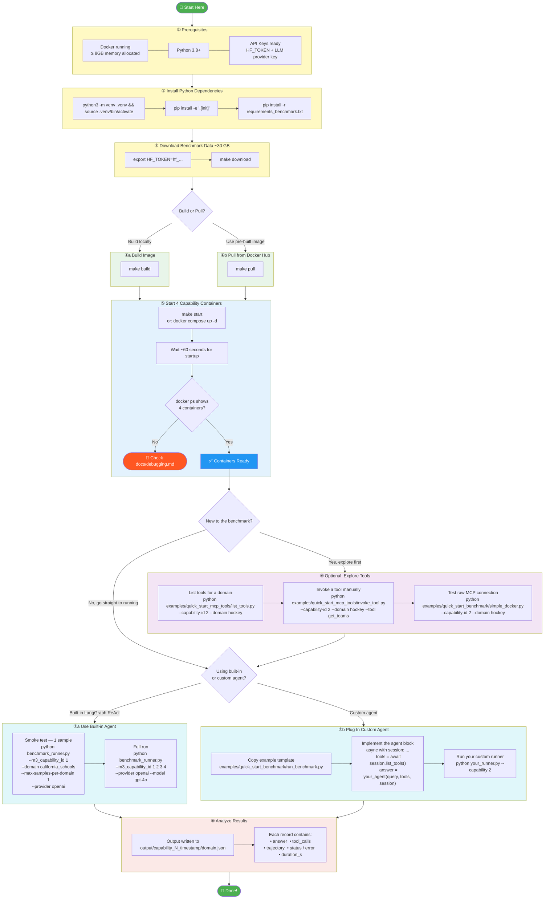

# Benchmark Runner Guide

Step-by-step workflow for running agent benchmarks against this repo.

## Flowchart

> **View this chart:** paste it into [mermaid.live](https://mermaid.live), open this file in VSCode with the [Markdown Preview Mermaid Support](https://marketplace.visualstudio.com/items?itemName=bierner.markdown-mermaid) extension, or push to GitHub (renders natively).



---

## Steps at a Glance

| Step | Action | Command |
|------|--------|---------|
| ① | Prerequisites | Docker ≥ 8 GB, Python 3.8+, API keys |
| ② | Install deps | `pip install -e '.[init]' && pip install -r requirements_benchmark.txt` |
| ③ | Download data | `export HF_TOKEN=hf_... && make download` |
| ④ | Get Docker image | `make build` or `make pull` |
| ⑤ | Start containers | `make start` → wait 60s → `docker ps` |
| ⑥ | (Optional) Explore | `list_tools.py`, `invoke_tool.py`, `simple_docker.py` |
| ⑦ | Run benchmark | `benchmark_runner.py` or your custom runner |
| ⑧ | Analyze results | `output/capability_N_timestamp/domain.json` |

---

## Capability Reference

| Capability | What it tests | Key domains |
|---|---|---|
| **1** | Tool selection & slot filling | `california_schools`, `hockey` |
| **2** | SQL query construction via REST | `hockey`, `address` |
| **3** | Multi-hop (BPO + SQL routing) | `address` |
| **4** | Multi-turn with semantic search | any |

---

## Common `benchmark_runner.py` Flags

```bash
# Smoke test — 1 sample, 1 domain
python benchmark_runner.py --m3_capability_id 1 --domain california_schools --max-samples-per-domain 1 --provider openai

# Full run across all capabilities
python benchmark_runner.py --m3_capability_id 1 2 3 4 --provider openai --model gpt-4o

# Run capabilities in parallel
python benchmark_runner.py --m3_capability_id 2 4 --parallel

# Use Anthropic instead
python benchmark_runner.py --m3_capability_id 2 --provider anthropic --model claude-sonnet-4-5-20250929

# Enable top-k tool shortlisting
python benchmark_runner.py --m3_capability_id 2 --top-k-tools 10

# Custom output directory
python benchmark_runner.py --m3_capability_id 2 --output my_results/
```

---

## Custom Agent Integration

Copy [`examples/quick_start_benchmark/run_benchmark.py`](../examples/quick_start_benchmark/run_benchmark.py) and replace the agent placeholder:

```python
async with stdio_client(params) as (read, write):
    async with ClientSession(read, write) as session:
        await session.initialize()
        tools = (await session.list_tools()).tools

        # Replace this block with your agent
        answer = await your_agent(query=item.query, tools=tools, session=session)
```

Your agent receives:
- `item.query` — the natural language question
- `tools` — list of MCP tool definitions
- `session` — live MCP session; call `session.call_tool(name, args)` to invoke tools

---

## Where to View the Flowchart

| Option | How |
|--------|-----|
| **Online (easiest)** | Paste the Mermaid block into [mermaid.live](https://mermaid.live) |
| **VSCode** | Install [Markdown Preview Mermaid Support](https://marketplace.visualstudio.com/items?itemName=bierner.markdown-mermaid), then open preview (`Cmd+Shift+V`) |
| **GitHub** | Push this file — GitHub renders Mermaid natively in `.md` files |
| **JetBrains IDEs** | Install the [Mermaid plugin](https://plugins.jetbrains.com/plugin/20146-mermaid) |
